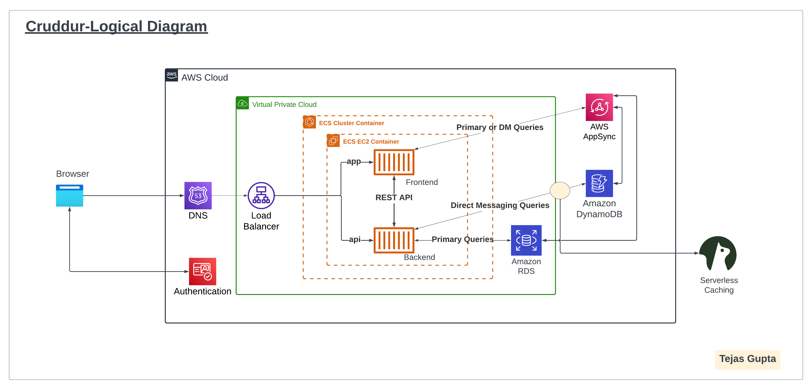
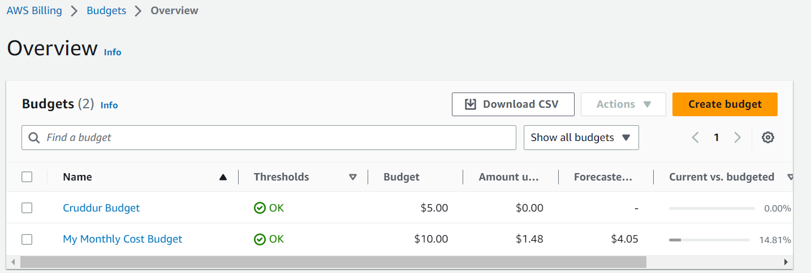
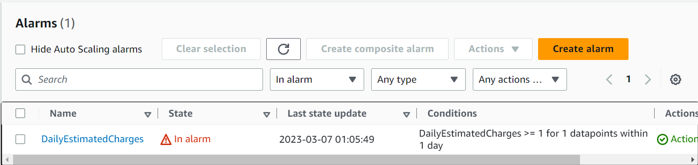

# Week 0 — Billing and Architecture

## Required task

I have completed watching following Videos:<br>

- [Live Streamed Video](https://www.youtube.com/watch?v=SG8blanhAOg&list=PLBfufR7vyJJ7k25byhRXJldB5AiwgNnWv&index=12)
- [Spend Considerations](https://www.youtube.com/watch?v=OVw3RrlP-sI&list=PLBfufR7vyJJ7k25byhRXJldB5AiwgNnWv&index=13)
- [Security Considerations](https://www.youtube.com/watch?v=4EMWBYVggQI&list=PLBfufR7vyJJ7k25byhRXJldB5AiwgNnWv&index=15)

### Recreated the Conceptual Architectural Deisgn [Lucid Charts Share Link](https://lucid.app/lucidchart/bddb7abd-ce99-4fe8-bdea-4b6cac593b02/edit?viewport_loc=-610%2C-395%2C2675%2C1220%2C0_0&invitationId=inv_9247036a-92e3-441a-9dba-b31a08cd03fd)


### Created the Logical Diagram [Lucid Charts Share Link](https://lucid.app/lucidchart/0a38119e-29b1-483d-aaed-9e17ae2713d8/edit?viewport_loc=1076%2C-102%2C1024%2C467%2C0_0&invitationId=inv_8fde57b7-434d-4ec2-87f6-578fe6394683)




- #### Added a extra Security layer by adding MFA to root account


- #### Used the Cloudshell and ran the command `aws sts get-caller-identity` 


### Install AWS CLI <br>
I have used gitpod to install aws cli <br>
Following commands were used to install it - 
```
curl "https://awscli.amazonaws.com/awscli-exe-linux-x86_64.zip" -o "awscliv2.zip"
unzip awscliv2.zip
sudo ./aws/install
```

Also exported my AWS User Access key, Secret key and Region for configuring my account
```
export AWS_ACCESS_KEY_ID="AKIAVAVAFTIN5N"
export AWS_SECRET_ACCESS_KEY="tE40HNj0G0C/WZZxOKjHixV7UTAX"
export AWS_DEFAULT_REGION="ap-south-1"
```

But as we use a new gitpod workspace, the whole enviroment get reset, so we need some automation to install and configure the gitpod workspace.<br>
To install AWS CLI, we have written a script - [.gitpod.yml](../.gitpod.yml)<br>
For having environment variables, we can save it on gitpod using following command:
```
gp env AWS_ACCESS_KEY_ID="AKIAVAVAFTIN"
gp env AWS_SECRET_ACCESS_KEY="tE40HNj0G0C/WZZxOKjHixV7UTAXH"
gp env AWS_DEFAULT_REGION="ap-south-1"
```

### Created an AWS Budget

[aws budgets create-budget](https://docs.aws.amazon.com/cli/latest/reference/budgets/create-budget.html)


- Supply your AWS Account ID
- Update the json files
- This is another case with AWS CLI its just much easier to json files due to lots of nested json

```sh
aws budgets create-budget \
    --account-id AccountID \
    --budget file://aws/json/budget.json \
    --notifications-with-subscribers file://aws/json/budget-notifications-with-subscribers.json
```
### Output for Budget



## Created a Billing Alarm

### Create SNS Topic

- We need an SNS topic before we create an alarm.
- The SNS topic is what will delivery us an alert when we get overbilled
- [aws sns create-topic](https://docs.aws.amazon.com/cli/latest/reference/sns/create-topic.html)

We'll create a SNS Topic
```sh
aws sns create-topic --name cruddur-billing-alarm
```
which will return a TopicARN

We'll create a subscription supply the TopicARN and our Email
```sh
aws sns subscribe \
    --topic-arn TopicARN \
    --protocol email \
    --notification-endpoint your@email.com
```

Check your email and confirm the subscription

#### Create Alarm

- [aws cloudwatch put-metric-alarm](https://docs.aws.amazon.com/cli/latest/reference/cloudwatch/put-metric-alarm.html)
- [Create an Alarm via AWS CLI](https://aws.amazon.com/premiumsupport/knowledge-center/cloudwatch-estimatedcharges-alarm/)
- We need to update the configuration json script with the TopicARN we generated earlier
- We are just a json file because --metrics is is required for expressions and so its easier to us a JSON file.

```sh
aws cloudwatch put-metric-alarm --cli-input-json file://aws/json/alarm_config.json
```

### Output of Billing Alarm




