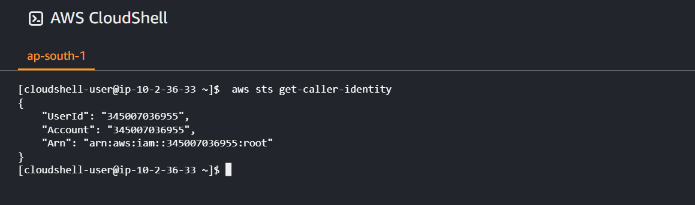

# Week 0 — Billing and Architecture

Required task

I have completed watching following Videos: 
Live Streamed Video - https://www.youtube.com/watch?v=SG8blanhAOg&list=PLBfufR7vyJJ7k25byhRXJldB5AiwgNnWv&index=12  
Spend Considerations - https://www.youtube.com/watch?v=OVw3RrlP-sI&list=PLBfufR7vyJJ7k25byhRXJldB5AiwgNnWv&index=13  
Security Considerations - https://www.youtube.com/watch?v=4EMWBYVggQI&list=PLBfufR7vyJJ7k25byhRXJldB5AiwgNnWv&index=15 

Recreated the Conceptual Architectural Deisgn [lucid chart link]

[Lucid Charts Share Link](https://lucid.app/lucidchart/bddb7abd-ce99-4fe8-bdea-4b6cac593b02/edit?viewport_loc=-610%2C-395%2C2675%2C1220%2C0_0&invitationId=inv_9247036a-92e3-441a-9dba-b31a08cd03fd)

The background color should be `#ffffff` for light mode and `#0d1117` for dark mode.

Added a extra Security layer by adding MFA to root account

Used the Cloudshell and ran the command `aws sts get-caller-identity` 

Install AWS CLI
I have used gitpod to install aws cli 
Following commands were used to install it - 
curl "https://awscli.amazonaws.com/awscli-exe-linux-x86_64.zip" -o "awscliv2.zip"
unzip awscliv2.zip
sudo ./aws/install

Also exported my AWS User Access key, Secret key and Region for configuring my account
export AWS_ACCESS_KEY_ID="AKIAVAVAFTIN5N"
export AWS_SECRET_ACCESS_KEY="tE40HNj0G0C/WZZxOKjHixV7UTAX"
export AWS_DEFAULT_REGION="ap-south-1"

But as we use a new gitpod workspace, the whole enviroment get reset, so we need some automation to install and configure the gitpod workspace.
To install AWS CLI, we have written a script - [.gitpod.yml](../.gitpod.yml)
For having environment variables, we can save it on gitpod using following command:
gp env AWS_ACCESS_KEY_ID="AKIAVAVAFTIN"
gp env AWS_SECRET_ACCESS_KEY="tE40HNj0G0C/WZZxOKjHixV7UTAXH"
gp env AWS_DEFAULT_REGION="ap-south-1"

Budget

Billing Alarm

