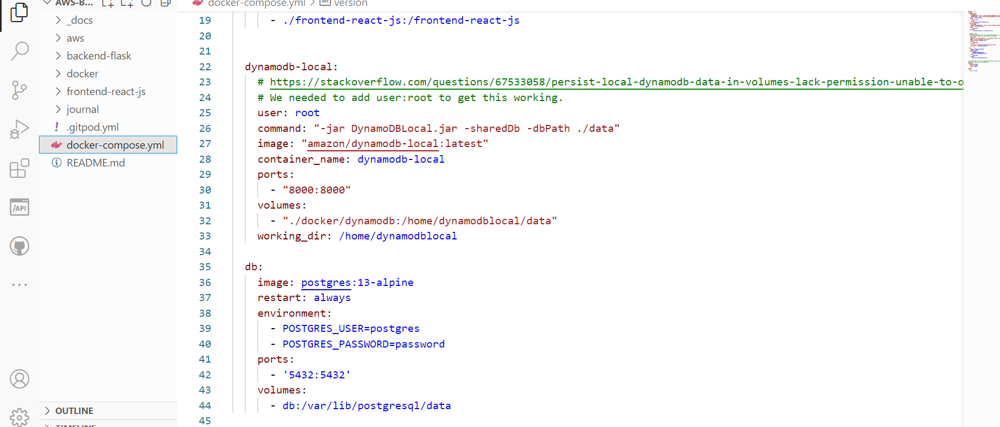
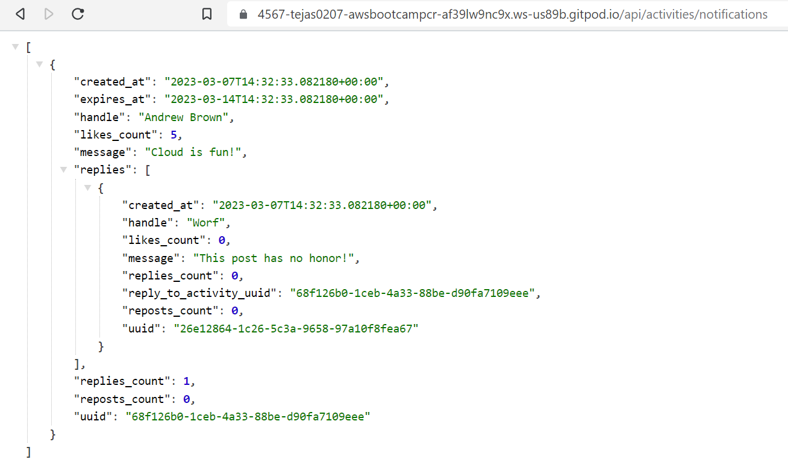
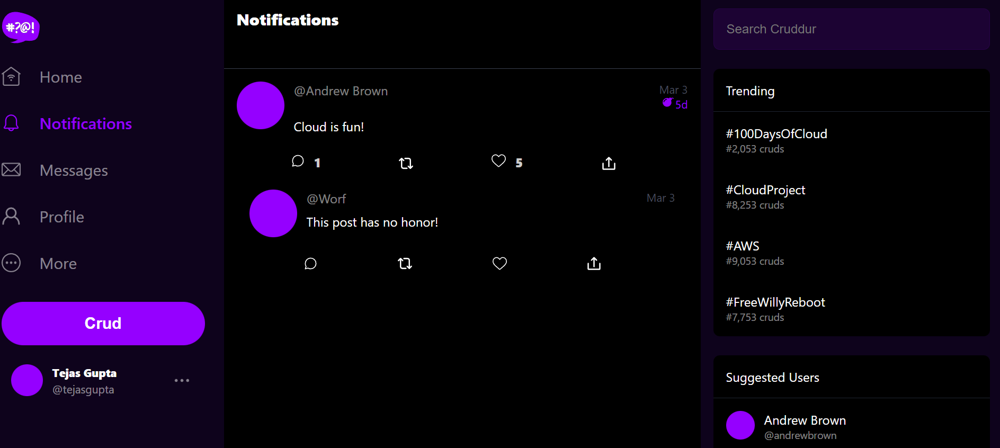

# Week 1 — App Containerization

## Required task

I have completed watching following Videos:<br>

- [Live Streamed Video](https://www.youtube.com/watch?v=zJnNe5Nv4tE&list=PLBfufR7vyJJ7k25byhRXJldB5AiwgNnWv&index=22)
- [Spend Considerations](https://www.youtube.com/watch?v=OAMHu1NiYoI&list=PLBfufR7vyJJ7k25byhRXJldB5AiwgNnWv&index=24)
- [Container Security Considerations](https://www.youtube.com/watch?v=4EMWBYVggQI&list=PLBfufR7vyJJ7k25byhRXJldB5AiwgNnWv&index=25)
- [Technical help](https://www.youtube.com/watch?v=4EMWBYVggQI&list=PLBfufR7vyJJ7k25byhRXJldB5AiwgNnWv&index=29)

### Containerize Backend

Before directly containerizing the backend, I started the backend the the localhost of GitPod
I used the following command to run the backend
```sh
cd backend-flask
export FRONTEND_URL="*"
export BACKEND_URL="*"
python3 -m flask run --host=0.0.0.0 --port=4567
 ```
 Here giving the environment variables is necessary as it is required in app.py, if we don't give the variables it will fail the run.
 After Opening the Port 4567, we can append `/api/activities/home` to Url so we can get the json output
 
 Now to Dockerize this backend application, I created a `Dockerfile` inside backend-flask.
 
 ```Dockerfile
FROM python:3.10-slim-buster
WORKDIR /backend-flask
COPY requirements.txt requirements.txt
RUN pip3 install -r requirements.txt
COPY . .
ENV FLASK_ENV=development
EXPOSE ${PORT}
CMD [ "python3", "-m" , "flask", "run", "--host=0.0.0.0", "--port=4567"]
 ```
 Now let's understand this file line by line 
 1. `FROM python:3.10-slim-buster` This line specifies a base image _python_ with a tag _3.10-slim-buster_ that will be used as a layer on which our application will be running.
 2. `WORKDIR /backend-flask` Whenever we login into any linux there is a default working directory where we are placed, so using **WORKDIR** we are specifying the default working directory for our container.
 3. `COPY requirements.txt requirements.txt` It is copying the requirements.txt from localhost to container.
 4. `RUN pip3 install -r requirements.txt` This will run the pip3 command on the container
 5. `COPY . .` It will copy all the files from local host to working directory of Container
 6. `ENV FLASK_ENV=development` It is setting an Environment variable in the container enviroment Flask_ENV=development
 7. `EXPOSE ${PORT}` It is expose the port that we will use to run our backend application
 8. `CMD [ "python3", "-m" , "flask", "run", "--host=0.0.0.0", "--port=4567"]` This will run the command _**python3 -m flask run --host=0.0.0.0 --port=4567**_ to start the backend application

Now to build an image using docker file we have to run `docker build -t  backend-flask ./backend-flask`
After building the image, we can check it by running `docker images` command, this will list all the available images in your system.

#### Run Container

```sh
docker run --rm -p 4567:4567 -it -e FRONTEND_URL='*' -e BACKEND_URL='*' backend-flask
```
or
```sh
export FRONTEND_URL="*"
export BACKEND_URL="*"
docker run --rm -p 4567:4567 -it  -e FRONTEND_URL -e BACKEND_URL backend-flask
```

#### Run Container in Background

```
docker container run --rm -p 4567:4567 -d -e FRONTEND_URL='*' -e BACKEND_URL='*' backend-flask
```
## Containerize Frontend

We have to run `npm install` before building the container since it needs to copy the contents of node_modules

```sh
cd frontend-react-js
npm i
```

Now to Dockerize this backend application, I created a `Dockerfile` inside _frontend-react-js_.

```Dockerfile
FROM node:16.18
ENV PORT=3000
COPY . /frontend-react-js
WORKDIR /frontend-react-js
RUN npm install
EXPOSE ${PORT}
CMD ["npm", "start"]
```
 Now let's understand this file line by line
 1. `FROM node:16.18` This line specifies a base image _node_ with a tag _16.18_ that will be used as a layer on which our frontend application will be running.
 2. `ENV PORT=3000` It is setting an Environment variable in the container enviroment PORT=3000
 3. `COPY . /frontend-react-js` Copy every file from local host to /frontend-react-js on container
 4. `WORKDIR /frontend-react-js` It specifies the default working directory for container.
 5. `RUN npm install` It will run _npm install_ command on the container
 6. `EXPOSE ${PORT}` It is expose the port that we will use to run our frontend application
 7. `CMD ["npm", "start"]` It will run the command _npm start_ in the container

#### Build Container Image
```sh
docker build -t frontend-react-js ./frontend-react-js
```
#### Run Container
```sh
docker run -p 3000:3000 -d frontend-react-js
```
## Create docker-compose.yml
As I have multiple containers to manage, I have used Docker compose and managed the containerization of both backend and frontend.
Also I have added Database as a container by adding DynamoDB and Postgres in the same [`docker-compose.yml`](../docker-compose.yml) at the root of project.

Here's how it would look in GitPod



- Added a backend endpoint for notifications by editing `openapi-3.0.yml` and `app.py`

openapi-3.0.yml
```openapi-3.0.yml

/api/activties/notifications:
    get:
      description: 'Return a feed of activities for all of those I follow'
      tags:
        - activities
      parameters: []
      responses:
        '200':
          description: Returns an array of activities"
          content:
            application/json:
              schema:
                type: array
                items:
                  $ref: '#/components/schemas/Activity'
```

app.py

```py

from services.notifications_activity import *

@app.route("/api/activities/notifications", methods=['GET'])
def data_notifications():
  data = NotificationsActivities.run()
  return data, 200
```

Here's the json output when we go to backend url with `/api/activities/notifications` path



## Notification Page

Added the notification page for frontend-react by editing [`App.js`](../frontend-react-js/src/App.js) and creating [`NotificationsFeedPage.js`](../frontend-react-js/src/pages/NotificationsFeedPage.js)

Here's the [code changes](https://github.com/tejas0207/aws-bootcamp-cruddur-2023/commit/96fca2715c41ffc378cb86af7183e6036a929412) for achieving the notification page

Here's the Output 



## Homework Challenges
1. Run the dockerfile CMD as an external script
2. Push and tag a image to DockerHub
3. Launch an EC2 instance that has docker installed, and pull a container to demonstrate you can run your own docker processes.

I have clubed this 3 challenges and created a solution for it.

To run the CMD instruction in a Dockerfile as an external script, I created a `Dockerfile` and an external script `script.sh`

```
FROM python
COPY script.sh /
RUN chmod +x /script.sh

CMD ["./script.sh"]
```
```
#!/bin/bash

echo "Testing external script for Dockerfile!"
```


